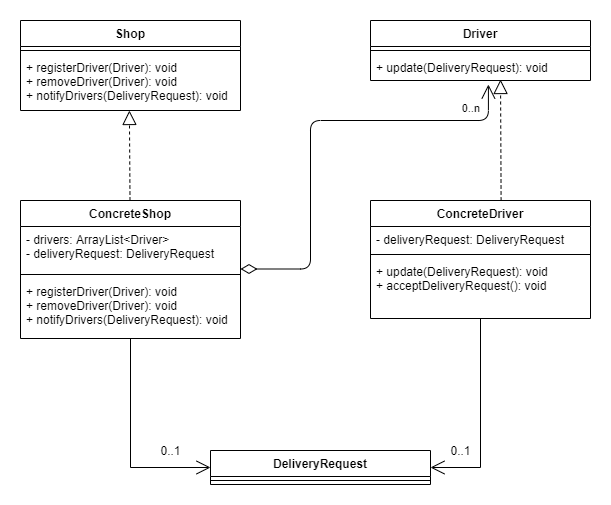

This is a Java Maven project.

# Task 1 – Implementation description

This assignment was implemented with the observer software design pattern. Two interfaces were defined, one for observable and one for observer. The interface Shop defines the methods registerDriver, removeDriver, and notifyDrivers to be implemented by the class ConcreteShop (observable). And the interface Driver defines the method update to be implemented by the class ConcreteDriver (observer). The observer pattern implementation was chosen because it allows ConcreteDrivers to be registered with a ConcreteShop and then the ConcreteShop can notify all ConcreteDrivers by calling the update method in the ConcreteDriver when there is news: when there is a new delivery request (the DeliveryRequest class encapsulates the message to be sent by the observable ConcreteShop to the observers ConcreteDrivers). So, the ConcreteDrivers do not have to constantly contact the ConcreteShop whether there is a new delivery request.
<br><br>
The observer pattern makes the implementation more flexible because ConcreteShop and ConcreteDriver are weakly coupled. The ConcreteShop object does not need any knowledge of the concrete implementation of the ConcreteDriver, but only needs to know the update method in ConcreteDriver. This makes it possible to add (or remove) ConcreteDrivers with different implementation, as long as the update method is implemented correctly. However, the disadvantage is that a new message (DeliveryRequest object) in the ConcreteShop, leads to a change (push notification) in all ConcreteDrivers; which, if there are many updates, means many changes in the ConcreteDrivers and ConcreteShop – which, as implemented, do not log the changes and therefore have no knowledge of the past changes. The implementation of the observer pattern is easy to understand in this implementation, but its implementation can become complex: e.g., if several ConcreteShops send notifications in parallel, assign delivery requests, and drivers accept and deliver in parallel. Such an implementation would make it hard to understand which specific states the ConcreteDrivers have in the program. Duplicated code was avoided by implementing one ConcreteDriver and one ConcreteShop class. Should some ConcreteDriver or ConcreteShop differ in the implementation, they can inherit the implemented update or registerDriver, removeDriver, notifyDrivers methods.
<br><br>
It was assumed that all observers are the same, therefore one ConcreteDriver class was implemented and not several classes like ConcreteUPSCar, ConcreteUPSVan, ConcreteDHL, Concrete... The same was assumed for observable, one ConcreteShop class was implemented. A driver accepts the delivery request via acceptDeliveryRequest method in a hard coded test case; no complex logic has been implemented (simulation of distance of driver to shop, traffic, etc.). And if the ConcreteShop sends (notifies) null instead of a DeliveryRequest object, this means that there is currently no delivery request that the drivers can accept.

# Task 2 – UML Class diagram



# Task 3 – Compile and run the project

You need to install Apache Maven (https://maven.apache.org/) to run this project.

# Compile the project

```bash
mvn clean compile
```

# Create a binary runnable package

```bash
mvn clean compile assembly:single
```

# Run the project

```bash
mvn -q clean compile exec:java -Dexec.executable="edu.bu.ms.cs.Main" -Dlog4j.configuration="file:log4j.properties"
```

# Run the project with unit test output

```bash
mvn -q clean compile exec:java -Dexec.executable="edu.bu.ms.cs.Main" -Dlog4j.configuration="file:log4j.properties" test
```

# Run all checks: unit test classes, checkstyle, and SpotBugs.

```bash
mvn clean compile test checkstyle:check  spotbugs:check
```
