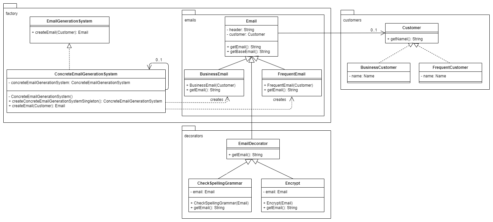

This is a Java Maven project.

# Task 1 – Implementation description

Assignment 2 was implemented using three software design patterns: factory method, singleton, and decorator pattern. The program is divided into three parts. There are customer classes which are implemented without a design pattern. The customer classes (Customer, BusinessCustomer, FrequentCustomer, NewCustomer, ReturningCustomer, and VipCustomer) contain information about the customers. Each customer class has only one attribute name, but the customer classes can easily be expanded by adding new attributes. The EmailGenerationSystem was implemented as a singleton so that only a single instance of the EmailGenerationSystem can be created. The advantage is that emails can only be created with this one instance and so access to the email creation must always run through this one instance. The EmailGenerationSystem was also implemented with the factory method pattern that creates an email of the appropriate type based on the type of the given customer object, e.g., if the customer type is BusinessCustomer, then an email of the type BusinessEmail is created. This implementation was chosen to decouple the creation of emails in the EmailGenerationSystem from the email classes to be created. Each email class has a partial implementation of the decorator pattern. In the task it was stated that there should be a basic email template (Email class) and that every specific email template (BusinessEmail, FrquentEmail, ...) should have a unique component. This was implemented by obtaining the email content of the basic email by calling the getBaseEmail() method – defined in the superclass Email – in the subclasses and adding the unique component in the getEmail() method. This has the advantage that components can be added to or removed from the emails at runtime. And the behavior that the grammar and spelling of emails is checked and that emails can be encrypted was implemented via a fully implemented decorator pattern. This was done because not every email has to be checked for spelling and grammar or encrypted; but this behavior can be added at runtime using the decorator pattern. And by wrapping email objects, several behaviors can be added to the emails. An email can be wrapped twice or more: with the behavior of checking the spelling and grammar and the behavior of being encrypted.
<br><br>
The factory method pattern makes the code moderately flexible, because every class that is added must be included in the if else or switch statement in the concrete factory method (createEmail()). On the other hand, should classes be removed, the statement does not necessarily have to be adapted, but should be because the case can never be reached. However, after the if else or switch statement has been adapted, no further changes need to be made in the existing code to insert new email classes. The new email classes need only to be added to the emails package. The singleton makes the code a little less flexible because, should the case arise that several instances EmailGEnerationSystem have to be created, this is not possible without changing the code. However, adapting the singleton ConcreteEmailGEnerationSystem to a non-singleton is possible with very little effort. The decorator pattern offers a high degree of flexibility, as individual decorator classes only have to be removed from or added to the decorator package. And every added decorator must have an email object and getEmail() method implemented to add behavior to emails. However, the decorator pattern can also severely limit the flexibility. Should it be necessary that individual decorators that have been added once have to be removed again during runtime, this would require changes in the code. And should it be necessary to adhere to a certain sequence when adding decorators, this will lead to inflexible, complex code.
<br><br>
Singleton and factory method pattern are easy to understand. However, the decorator pattern is more difficult to understand at first. It must be understood which components each class must contain and which interaction of interfaces, abstract classes, and concrete classes offers the best implementation.
<br><br>
Duplicate code has been avoided by defining the basic information and method that all emails contain in the superclass Email. Each subclass then sets individual information by calling the super constructor. And unique components are added to the email by obtaining the basic information via the getBaseEmail() method in the superclass and then adding unique components. In contrast, with the factory method pattern, a certain amount of almost duplicate code in the switch statement was necessary in the factory method to create the correct email objects. And since the decorator pattern adds behavior in the code by calling the getEmail() method in the overridden getEmail() method, the entire code of the superclass does not have to be implemented again in the getEmail() method in each subclass.
<br><br>
It was assumed that no actual emails have to be generated in HTML format, but that the implemented patterns contain all relevant information after applying singleton, factory method, and decorator pattern. Therefore, the log output for the tests is a String that contains the information on the specific customer, header text, main text, footer text, unique component, and the added decorator. And in the end, the created email is represented by a String containing all the information.

# Task 2 – UML Class diagram



# Task 3 – Compile and run the project

You need to install Apache Maven (https://maven.apache.org/) to run this project.

# Compile the project

```bash
mvn clean compile
```

# Create a binary runnable package

```bash
mvn clean compile assembly:single
```

# Run the project

```bash
mvn -q clean compile exec:java -Dexec.executable="edu.bu.ms.cs.Main" -Dlog4j.configuration="file:log4j.properties"
```

# Run the project with unit test output

```bash
mvn -q clean compile exec:java -Dexec.executable="edu.bu.ms.cs.Main" -Dlog4j.configuration="file:log4j.properties" test
```

# Run all checks: unit test classes, checkstyle, and SpotBugs.

```bash
mvn clean compile test checkstyle:check  spotbugs:check
```
