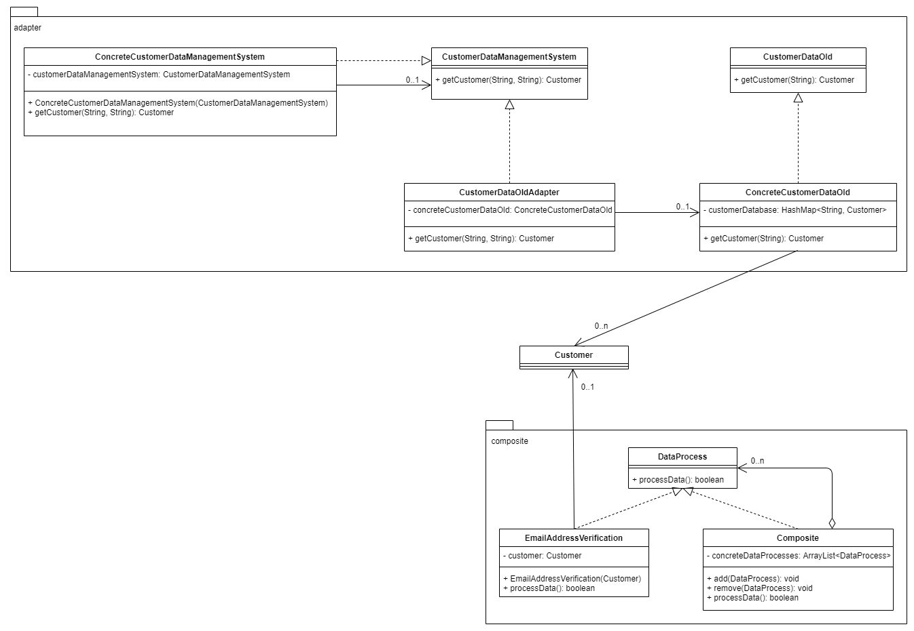

This is a Java Maven project.

# Task 1 – Implementation description

Assignment 3 was implemented using two software design patterns: adapter pattern and composite pattern. The adapter pattern was chosen because the adapter pattern ensures that the old API CustomerDataOld can continue to be used, while the new API CustomerDataManagementSystem can also be used. For this purpose, the new interface CustomerDataManagementSystem was realized by the client (ConcreteCustomerDataManagementSystem) and by the class CustomerDataOldAdapter (adapter). And the CustomerDataOldAdapter class contains (associates) a CustomerDataOld object. In the CustomerDataManagementSystem (new API) the getCustomer(String, String) method is called; in this method, method getCustomer(String, String) of the CustomerDataOldAdapter is called, which in turn calls the method getCustomer(String) of ConcreteCustomerDataOld. Then the customer object is returned from the database to the external company using the return statements of all methods above (method1 calls method2 calls method3, and method3 returns customer object to method2, and method2 to method 1). This allows external companies to use the new API even though it is not yet fully implemented; and internally, the old API can still be used. Adding and removing of data processing was implemented using the composite pattern, because the composite pattern ensures that different data processing functionalities can be added or removed from customer objects (containing customer data) at runtime. The functionalities email address verification, background checks, welcome email generation and send, and rejection email generation and send were implemented as leaves (composite pattern). If some or all of these functionalities have been added to the composite in a certain order, then they can be carried out in the order in which they were added.
<br><br>
The adapter pattern offers a high degree of flexibility. The old API can be used through the adapter via the new API, and the old API can also be used without the new API. Furthermore, the code for the old API or for other business logic can be changed without having to change the adapter or the new API – as long as the getCustomer method does not change. It is also possible to add or remove more than one adapter from the code without having to change the existing code. The flexibility of the composite pattern is mediocre. New data processing functions can be added by adding new leaves (classes) that implement the DataProcess interface. Leaves can also be removed from the code without having to change the code elsewhere. However, only new leaves that are similar in functionality can/should be added. Because in every leaf class the proceeData method is implemented and executed. And what the method executes should also have a meaningful connection to the method name processData.
<br><br>
The adapter pattern is easy to understand if it is understood which classes belong to the adaptee (here the class ConcreteCustomerDataManagementSystem). The composite pattern is theoretically a bit more difficult to understand because the pattern is described as a tree structure that can use recursive method calls. However, in the chosen implementation it is only necessary to understand which class is the composite class and then it is clear that the rest, except for the interface DataProcess, must be the leaves that implement the interface’s processData method. And then the functionality is self-explanatory.
<br><br>
The adapter pattern uses almost duplicate code, which cannot be avoided. The new API implements the getCustomer method, the adapter has a similar getCustomer method implemented, and there is the existing getCustomer method to be adapted in the old API. However, this is the way in which the adapter pattern is to be implemented when the adapter pattern is implemented as an object adapter. In the composite pattern, duplicate code is avoided through the composite class, because the methods add, remove, and call all processData methods of the leaves are only defined in the composite class.
<br><br>
It was assumed that the old system already exists and that no complex database has to be created. Therefore, the database was implemented as HashMap <String, Customer> customerDatabase in the ConcreteCustomerDataOld class. It was also assumed that no actual data processing logic needs to be implemented. For example, the background check simply logs that the background check has been carried out and then returns true. For data processing, it was assumed that each process should be able to be added to specific customers in a specific order and removed again; so, the added data processing steps are not automatically applied to all customers. However, the existing “add” test case for the composite pattern could be adapted by putting the corresponding code into a for loop that iterates over all customers.

# Task 2 – UML Class diagram



# Task 3 – Compile and run the project

You need to install Apache Maven (https://maven.apache.org/) to run this project.

# Compile the project

```bash
mvn clean compile
```

# Create a binary runnable package

```bash
mvn clean compile assembly:single
```

# Run the project

```bash
mvn -q clean compile exec:java -Dexec.executable="edu.bu.ms.cs.Main" -Dlog4j.configuration="file:log4j.properties"
```

# Run the project with unit test output

```bash
mvn -q clean compile exec:java -Dexec.executable="edu.bu.ms.cs.Main" -Dlog4j.configuration="file:log4j.properties" test
```

# Run all checks: unit test classes, checkstyle, and SpotBugs.

```bash
mvn clean compile test checkstyle:check  spotbugs:check
```
