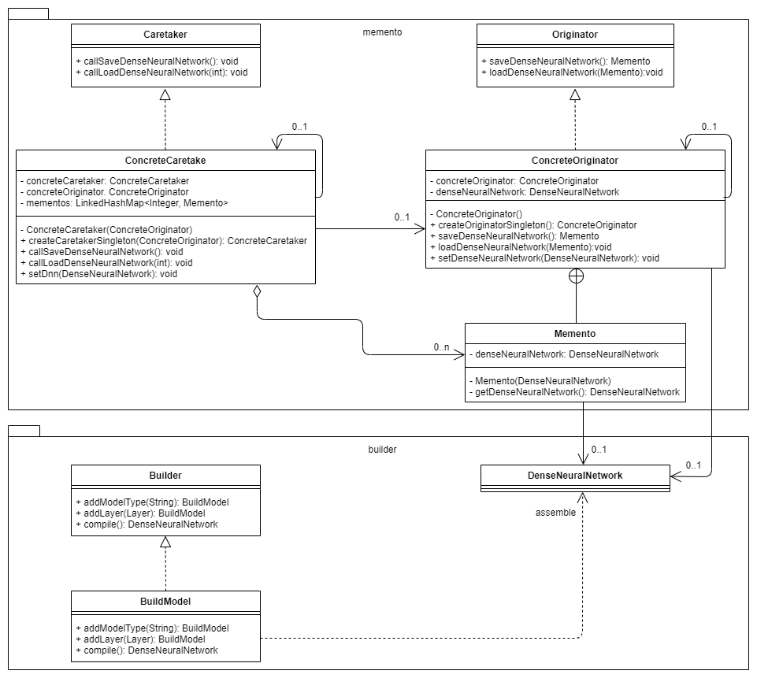

This is a Java Maven project.

# Task 1 – Design pattern and use case scenario description

The use case scenario is to build and fit dense neural network machine learning models. There is trial and error involved in building and fitting dense neural networks because the fitting process of dense neural networks uses numerical methods: the models / model weights are not calculated, but rather approximated step by step. E.g., a dense neural network can be built and used for fitting and the model has a prediction accuracy of X, then another layer is added and the prediction accuracy drops to X - Y. And then another layer is added and the prediction accuracy increases to X + 1/2Y. in this use case scenario it will help if the models can be saved and reloaded/restored. Which can be achieved, among other things, by using the memento pattern. The memento pattern was implemented with a supporting singleton pattern. Furthermore, dense neural networks consist of many components that should be easy to assemble. For this the builder pattern was used. The dense neural network components are: model type, layer(s), loss function, optimizer, and metric(s) (the components could be split up further).
<br><br>
As a design goal, dense neural network objects (built dense neural networks) should be stored/saved without the information about the dense neural network object having to be fetched from the object itself and without violating encapsulation. This can be achieved via the memento pattern. With the memento pattern, the entire dense neural network object is put in a memento object and a caretaker and originator object are used to do so. The caretaker makes the originator save the dense neural network object in a memento and the originator returns the memento to the caretaker, who keeps all mementos. If a dense neural network is to be loaded/restored from a memento, the caretaker passes the corresponding memento to the originator, which returns the dense neural network from the memento to the caretaker. The caretaker never changes the dense neural network directly in the memento, but lets the originator make the changes. And even if the caretaker or other objects besides the originator wanted to, they could not change the memento directly because the memento is implemented as an inner class of the ConcreteOriginator and all methods of the inner class are set private. This means that only the ConcreteOrginator object and the Memento object itself can change the memento directly.
Caretaker and originator were implemented as singletons. This means that only one instance of both objects can be created at runtime. And since only caretaker and originator work with mementos, having these singletons offers access control to the mementos. Note, the project is not multithreaded but would multithreading be implemented, only the implementation of the caretaker and originator as a singleton makes the mementos not thread safe. The aim of using the builder pattern is that the dense neural network can easily be created with different characteristics and that the complexity of creating a dense neural network is hidden from those who build dense neural network models. The builder pattern aims for high cohesion and decoupling: the DenseNeuralNetwork class contains all the attributes of the dense neural network, but no methods for building the dense neural network. And the BuildModel class contains all the methods for building the dense neural network but no dense neural network attributes.
<br><br>
The flexibility of the used memento pattern is high. The dense neural network stored in the memento can be adapted, attributes and methods can be added or removed, and the dense neural network can be saved in the memento or loaded from the memento without changing the code in the caretaker or originator. However, if functionality is added in the caretaker or originator, the code understandability can quickly decrease. Above all, there is a risk that methods that belong in the caretaker will be added to the originator and vice versa. Should new types be saved in a memento, this could also be implemented with little code adjustment. A new data structure could be created which is able to hold the new and old objects and this data structure is then given in the memento, so that no adjustments in the caretaker, originator or memento are necessary. The singleton pattern reduces the flexibility minimally because only one instance of the singleton caretaker and singleton originator can be created. However, both singleton implementations can easily be rewritten as non-singletons. And the builder pattern has a high degree of flexibility, because new building components can easily be added to or removed from the BuildModel class. However, this is only true if the order of assembly is irrelevant, as is the case with the dense neural network. Should a builder pattern be used when the order of assembly is relevant, the correct order, depending on the available components and status of the assembly, would have to be checked at every step, which reduces flexibility.
<br><br>
The memento pattern makes the code a bit less simplistic and more incomprehensible. The interplay between the caretaker, originator, and memento must first be understood in order to know how the memento pattern works and which functionality is encapsulated in which class. It must also be noted that there are several ways to implement the memento pattern and if the software developer knows one of them, but finds another in the code, this can lead to a lack of understanding. In contrast, singleton and builder patterns are very understandable. However, the understandability of the builder pattern can decrease if the sequence and permitted configurations have to be checked when assembling an object.
<br><br>
Duplicate code was avoided by implementing code that has clearly separated functionalities due to the chosen design patterns. It could be argued that the encapsulation of the memento pattern created a certain amount of almost duplicate code, which cannot be avoided because the caretaker passes on to the originator that a memento is to be created or a memento is to be loaded, i.e., a load or save method is called via the caretaker, which calls a load or save method in the originator. Furthermore, duplicate code was avoided by considering which main functionality belongs to which classes and defining interfaces.


# Task 2 – UML Class diagram


# Task 3 – Compile and run the project

You need to install Apache Maven (https://maven.apache.org/) to run this project.

# Compile the project

```bash
mvn clean compile
```

# Create a binary runnable package

```bash
mvn clean compile assembly:single
```

# Run the project

```bash
mvn -q clean compile exec:java -Dexec.executable="edu.bu.ms.cs.Main" -Dlog4j.configuration="file:log4j.properties"
```

# Run the project with unit test output

```bash
mvn -q clean compile exec:java -Dexec.executable="edu.bu.ms.cs.Main" -Dlog4j.configuration="file:log4j.properties" test
```

# Run all checks: unit test classes, checkstyle, and SpotBugs.

```bash
mvn clean compile test checkstyle:check  spotbugs:check
```
